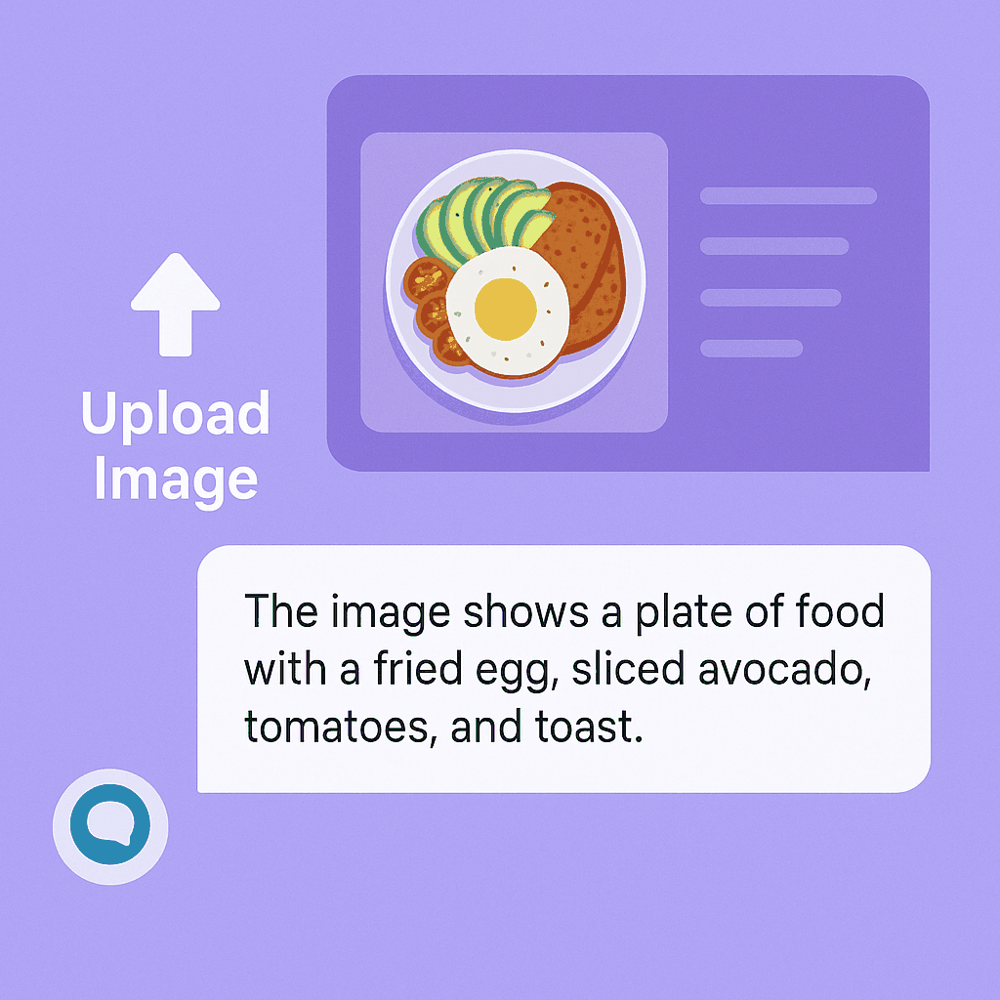

# AI Image Chatbot with Gemini API

## 📂Project Structure
```
aadi/  # Project root
│
├── app.py                # Main Flask application
├── requirements.txt      # Python dependencies
├── .env                  # Environment configuration
├── README.md             # This documentation
│
├── static/               # All static assets
│   │   └── uploads/          # Image uploads directory
│   └───────style.css     # Main stylesheet
│       ├── demo-animation.gif
│       ├── flask-logo.png
│       ├── gemini-logo.png
│       ├── landing-hero.png
│       ├── sqlite-logo.png
│       ├── user1.jpg
│       ├── user2.jpg
│       └── user3.jpg
│
├── templates/            # HTML templates
│   ├── base.html         # Base template
│   ├── index.html        # Main chat interface
│   ├── landing.html      # Landing page
│   ├── login.html        # Login page
│   ├── profile.html      # User profile
│   └── signup.html       # Registration page
│
└── instance/             # Auto-generated
    └── database.db       # SQLite database file
```
# AI-Powered Image Chatbot




A conversational Flask web application that uses Google's Gemini API to analyze images through natural language interactions.

## ✨ Features

- **Image Analysis**: Upload images and get AI-generated descriptions
- **Conversational Interface**: Ask follow-up questions about your images
- **User System**: Login, registration, and profile management
- **Responsive Design**: Works on desktop and mobile devices

## 🛠️ Tech Stack

  

- **Backend**: Python Flask
- **AI Engine**: Gemini 1.5 Flash API
- **Database**: SQLite with SQLAlchemy
- **Frontend**: HTML5, CSS3, Vanilla JavaScript
   ```
## 🚀 Quick Start

1. **Clone the repository**
   ```bash
   git clone https://github.com/Supriyadasari04/AI-Powered-Image-Chatbot.git
   cd AI-Powered-Image-Chatbot
   ```

2. **Set up environment**
   ```bash
   python -m venv venv
   # Windows:
   venv\Scripts\activate
   # Mac/Linux:
   source venv/bin/activate
   ```

3. **Install dependencies**
   ```bash
   pip install -r requirements.txt
   ```

4. **Configure environment**
   ```bash
   echo "GEMINI_API_KEY=your_api_key_here" > .env
   echo "SECRET_KEY=your_secret_key_here" >> .env
   ```

5. **Run the application**
   ```bash
   python app.py
   ```

6. **Ctrl + C**
   **Notice - a new instance folder to store database is created**

7. **Re-run the application**
   ```bash
   python app.py
   ```
Visit `http://localhost:5000` in your browser.

## 📚 Documentation

### File Structure
- `app.py`: Main application logic
- `static/`: All CSS, JS, and uploaded images
- `templates/`: HTML pages with Jinja2 templating
- `instance/`: Database storage

### API Endpoints
- `POST /upload`: Handle image uploads
- `POST /chat`: Process chat messages
- `GET /history`: Retrieve conversation history

## 🌈 Future Roadmap

- [ ] Image editing capabilities
- [ ] Multi-language support
- [ ] Advanced user analytics
- [ ] Docker deployment

## 🤝 Contributing

Pull requests are welcome! For major changes, please open an issue first.

## 📜 License

[MIT](https://choosealicense.com/licenses/mit/)
```
